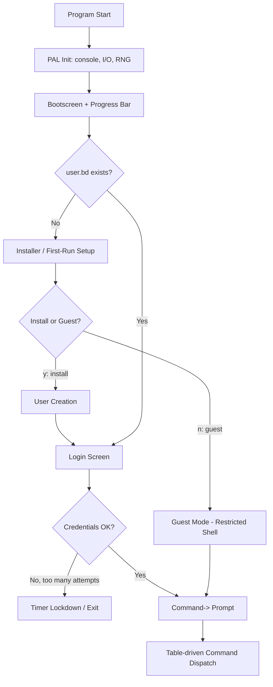
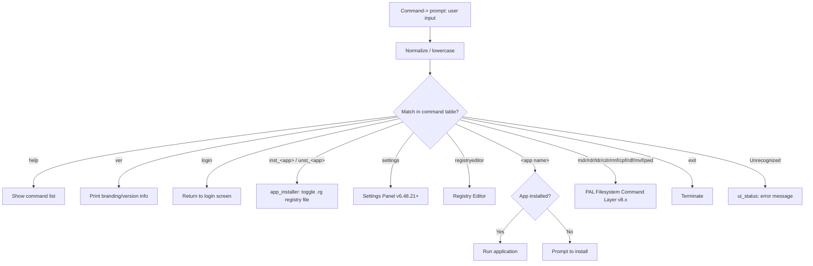
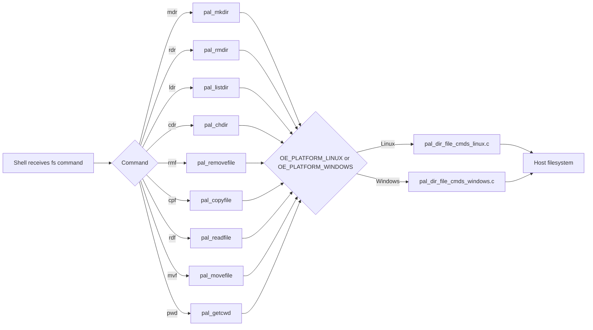
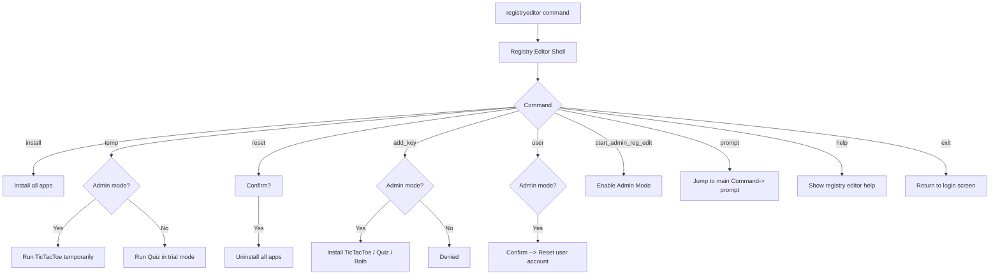
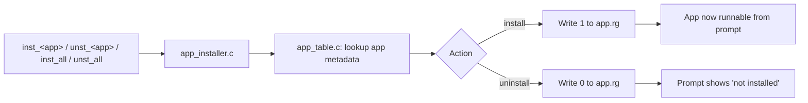
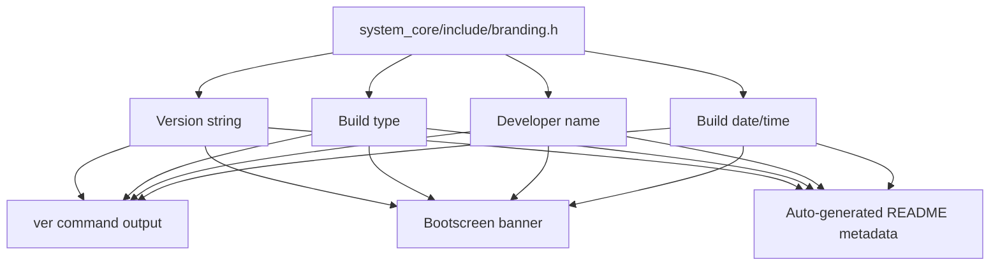

# 🚀 OE_REBOOT – Operating Environment Reboot

<div align="center">


-red)

**A complete reimagining of the classic console‑based "Operating Environment"**
From a school‑kid's hurried C++ experiment to a clean, modular C codebase — cross‑platform, tool‑rich, and evolving toward a full custom operating system.

*This document consolidates the history of every documented release: the original 2022 C++ prototype, v6.1.0, v6.12.56, v6.48.21, v8.13.07, and v8.42.28. Nothing from any prior README has been removed — this is the merged, canonical record.*

</div>

---

## 📖 Table of Contents

- [Overview](#-overview)
- [Why a Reboot?](#-why-a-reboot)
- [Evolution: Original (2022) → v6.12.56 → v6.48.21 → v8.13.07 → v8.42.28](#-evolution-original-2022--v61256--v64821--v81307--v84228)
- [Architecture at a Glance](#-architecture-at-a-glance)
- [Flowcharts](#-flowcharts)
- [Feature Comparison (All Releases)](#-feature-comparison-all-releases)
- [What's New — Per Release](#-whats-new--per-release)
  - [v6.12.56](#v61256--initial-c-port)
  - [v6.48.21](#v64821--full-feature-stable-release)
  - [v8.13.07](#v81307--the-pal-expansion-begins)
  - [v8.42.28](#v84228--current-development-snapshot)
- [Comparison: v8.13.07 → v8.42.28](#-comparison-v81307--v84228)
- [System Modules](#-system-modules)
- [File Structure](#-file-structure)
- [Building from Source](#-building-from-source)
- [First‑Time Usage](#-firsttime-usage)
- [Command Reference](#-command-reference)
- [Filesystem Commands](#-filesystem-commands)
- [Settings Panel](#️-settings-panel)
- [Registry Editor](#️-registry-editor)
- [Guest Mode](#-guest-mode)
- [Built-in Tools / Applications](#-built-in-tools--applications)
- [File Storage](#-file-storage)
- [Known Issues (All Releases)](#-known-issues-all-releases)
- [Roadmap / Future Plans](#️-roadmap--future-plans)
- [Version History](#-version-history)
- [Contributing](#-contributing)
- [Contact](#-contact)

---

## 🔍 Overview

**OE_REBOOT** is a ground‑up rewrite of the original **Operating Environment** — a retro console pseudo‑OS originally written in C++ back in **2022** by the author as a school hobby project. That first version, while functional and fun, was a classic example of **spaghetti code**:

- Everything crammed into a few files with global variables everywhere.
- Relied on Linux‑specific calls (`gotoxy`, `system("clear")`) — no Windows support.
- No separation between UI, logic, and file I/O.
- Hard‑coded screen coordinates, paths, and colors.
- Adding a new feature meant copying and pasting huge blocks of code.

The reboot (started in 2026) tackles these issues head‑on by introducing a **clean, modular C design** with a **Platform Abstraction Layer (PAL)**. The result is a codebase that is:

- ✅ **Cross‑platform** – runs flawlessly on Linux and Windows.
- ✅ **Maintainable** – clear modules (UI, user management, installer, registry, etc.).
- ✅ **Extensible** – new commands and apps are added via simple tables.
- ✅ **Portable** – the PAL can later be swapped for kernel syscalls in a real OS.

The project has since grown across **two major generations**:

- **OE_REBOOT v6.x** – the original C rewrite line: `v6.1.0` (PAL prototype) → `v6.12.56` (initial C port) → `v6.48.21` (full‑featured stable release with settings panel, registry admin mode, guest mode, and color wizard).
- **OE_REBOOT v8.x** – the next major milestone: `v8.13.07` → `v8.42.28` (current development snapshot), which begins expanding OE beyond a simple console environment, adding built‑in applications (Notepad, Calculator, System Information), a PAL‑backed filesystem command layer, a centralized branding system, and salted password hashing — while laying groundwork for a future custom kernel.

Together, these releases document the journey from a hobbyist's messy prototype to a robust, well‑architected simulation that is deliberately being engineered toward becoming a real, bootable operating environment.

**OE_REBOOT v8.42.28** is the current development snapshot of the project. OE is a modular console runtime written in C that centralises system services behind a Platform Abstraction Layer (PAL) and a small set of system modules. The intent is to evolve OE from a console environment toward a custom kernel and OS infrastructure over future releases.

Core design goals (carried through every release):

- Small, portable C codebase (C99)
- Clear subsystem boundaries (PAL, UI, system tools)
- Simple installer/registry for modular apps
- Console‑first UI with a structured, table‑driven command shell

---

## 🤔 Why a Reboot?

The original OE (circa 2022) was written in a hurry while the author was exploring C++. While it worked on the author's Linux machine / an online compiler, it suffered from:

- **Monolithic structure** – over 2000 lines in a single `main.cpp`, with global variables everywhere.
- **Platform lock‑in** – used `gotoxy()`, `system("clear")`, and Linux‑specific headers; impossible to run on Windows without massive changes.
- **No separation of concerns** – UI, logic, and file I/O were tangled together.
- **Hard‑coded everything** – screen coordinates, file names, color codes – all littered throughout the code.
- **Limited extensibility** – adding a new app meant copying an entire block and tweaking a few lines.

The reboot started with a simple goal: **rewrite everything in C, with a clean architecture, and make it cross‑platform**. The result is a codebase that demonstrates how even a chaotic hobby project can evolve into something elegant and future‑proof — and, with the v8.x line, into the early skeleton of a genuine operating system.

---

## 🔄 Evolution: Original (2022) → v6.12.56 → v6.48.21 → v8.13.07 → v8.42.28

| Aspect                    | Original (C++ 2022)              | v6.12.56 (C)                         | v6.48.21 (C)                             | v8.13.07 (C)                                    | v8.42.28 (C)                                              |
|---------------------------|-----------------------------------|----------------------------------------|--------------------------------------------|----------------------------------------------------|---------------------------------------------------------------|
| **Language**              | C++                                | C (C99)                                | C (C99)                                     | C (C99)                                             | C (C99)                                                        |
| **Structure**             | Monolithic (`main.cpp` + headers) | Modular (`*.c` / `*.h`)                | Same, with new modules                      | Same, plus filesystem + branding modules            | Same, plus notepad/calculator/systeminfo tools + password hashing |
| **Platform**              | Linux only                         | Linux + Windows (via PAL)              | Same                                        | Same                                                | Same                                                            |
| **Screen handling**       | `gotoxy()` + `system("clear")`    | `pal_set_cursor()` + `pal_clear_screen()` | Same, plus `ui_menu()`, `ui_confirm()`      | Same                                                 | Same                                                            |
| **User management**       | Basic text files (`file.txt`)     | Binary `user.bd` / `pwd.bd`            | Same, with better validation                | Same                                                 | Same, with salted SHA‑256 password hashing                     |
| **Application registry**  | Individual text files (`.txt`)    | Binary `.rg` files per app             | Same                                        | Same                                                 | Same                                                            |
| **Command shell**         | Giant `if-else` chain             | Table‑driven dispatch                  | Same, with guest restrictions               | Same, plus filesystem command dispatch               | Same                                                            |
| **Settings**              | Scattered, some in `settings()`   | –                                       | Full panel with user, reset, color          | Full panel (carried forward)                         | Full panel (carried forward)                                    |
| **Registry editor**       | `reg_edit()` with hard‑coded prompts | Basic version                        | Enhanced with admin mode, help              | Enhanced (carried forward)                           | Enhanced (carried forward)                                      |
| **Color personalization** | `color_change()` (raw ANSI)       | –                                       | Wizard with table preview                   | Wizard (carried forward)                             | Wizard (carried forward)                                        |
| **Guest mode**            | –                                   | –                                       | Yes, limited commands                        | Yes (carried forward)                                | Yes (carried forward)                                            |
| **Input validation**      | Minimal, prone to crashes          | `util_get_int()`, `util_get_double()`  | Same, integrated with UI                    | Same                                                  | Same                                                            |
| **Filesystem commands**   | ❌                                  | ❌                                       | ❌                                            | ✔ (`mdr`, `rdr`, `ldr`, `cdr`, `rmf`, `cpf`, `rdf`, `mvf`, `pwd`) | ✔ (implemented & exposed in `help`)                            |
| **Notepad editor**        | ❌                                  | ❌                                       | ❌                                            | ✔ (introduced)                                       | ✔ (full sources present)                                        |
| **Calculator tool**       | ❌                                  | ❌                                       | ❌                                            | ✔ (introduced)                                       | ✔ (full sources present)                                        |
| **System information utility** | ❌                            | ❌                                       | ❌                                            | ✔ (introduced)                                       | ✔ (full sources present)                                        |
| **Branding system**       | ❌                                  | ❌                                       | ❌                                            | ✔ (`branding.h` introduced)                          | ✔ (present & updated, generates this README's metadata)         |
| **Password hashing**      | ❌ (plaintext)                     | ❌ (plaintext binary)                   | ❌ (plaintext binary)                        | Basic / unspecified                                  | ✔ Salted SHA‑256 (`utilities/include/password_hash.h`)          |
| **Kernel/PAL groundwork** | –                                   | –                                       | –                                            | PAL foundation layer for future kernel               | PAL further expanded (`pal_kernel.c` stub carried, dir/file cmds) |

---

## 🏗️ Architecture at a Glance

This is the original high‑level architecture diagram, preserved unchanged from the v6.x documentation, since the same layering still holds for v8.x (the PAL box now additionally fans out to the filesystem‑command layer and built‑in tools):

```
┌─────────────────┐
│     main.c      │  – Entry point, initialises PAL, bootscreen,
│                 │    checks for existing user → installer or login.
└─────────────────┘
         │
         ▼
┌─────────────────────────────────────┐
│   Platform Abstraction Layer (PAL)   │  – pal_linux.c / pal_windows.c
│   (console, file I/O, strings,       │    Abstracts all OS dependencies.
│    random, sleep, dir/file cmds)     │
└─────────────────────────────────────┘
         │
         ▼
┌─────────────────────────────────────┐
│         UI Modules                   │  – ui_elements.c (layout, logo, progressbar)
│                                      │    ui_setup.c (menu, title, status, confirm)
└─────────────────────────────────────┘
         │
         ▼
┌──────────┬──────────┬──────────────┐
│ installer│ prompt   │ regedit      │  – Core interactive shells
│ settings │ help     │ extras       │    (each in its own file)
└──────────┴──────────┴──────────────┘
         │
         ▼
┌─────────────────────────────────────┐
│      User Management                 │  – login.c, user_creation.c,
│                                      │    password_management.c, user_id_change.c
└─────────────────────────────────────┘
         │
         ▼
┌─────────────────────────────────────┐
│      App Installer & Registry        │  – app_installer.c, app_table.c
│                                      │    Manages .rg files, install/uninstall.
└─────────────────────────────────────┘
```

---

## 🔀 Flowcharts

The diagrams below are new additions (rendered as Mermaid, GitHub‑native) that make the boot flow, command dispatch, and filesystem‑command path explicit across the whole codebase. They complement, and do not replace, the ASCII architecture diagram above.

### 1. Application Boot & Login Flow (all releases)



### 2. Table‑Driven Command Dispatch (v6.12.56 onward)



### 3. PAL Filesystem Command Layer (v8.13.07 / v8.42.28)



### 4. Registry Editor State Machine (v6.48.21+)



### 5. App Installer / Registry (`.rg` files) Lifecycle



### 6. Branding / Build Metadata Flow (v8.13.07+)



---

## 📊 Feature Comparison (All Releases)

| Feature                          | Original OE (2022) | v6.12.56 | v6.48.21 | v8.13.07 | v8.42.28 |
|-----------------------------------|:---:|:---:|:---:|:---:|:---:|
| Cross‑platform (Linux/Windows)    | ❌ (Linux only) | ✅ | ✅ | ✅ | ✅ |
| Modular codebase                  | ❌ | ✅ | ✅ | ✅ | ✅ |
| Binary file storage               | ❌ (text) | ✅ | ✅ | ✅ | ✅ |
| Table‑driven command shell        | ❌ | ✅ | ✅ | ✅ | ✅ |
| User accounts with passwords      | ✅ | ✅ (improved) | ✅ (even better) | ✅ | ✅ (salted SHA‑256) |
| Guest mode                        | ❌ | ❌ | ✅ | ✅ | ✅ |
| Installer / trial mode            | ✅ | ✅ | ✅ | ✅ | ✅ |
| Settings panel                    | ❌ (scattered) | ❌ | ✅ | ✅ | ✅ |
| Registry editor                   | ✅ (basic) | ✅ (basic) | ✅ (admin mode) | ✅ | ✅ |
| Color personalization             | ✅ (simple) | ❌ | ✅ (wizard) | ✅ | ✅ |
| Reset & restore                   | ❌ | ❌ | ✅ | ✅ | ✅ |
| Help system                       | ❌ | ❌ (basic prompt help only) | ✅ | ✅ | ✅ |
| Application placeholders          | ✅ (real apps) | ✅ (placeholders) | ✅ (placeholders) | ⚠️ Partial | ⚠️ Partial |
| Progress bar / bootscreen         | ✅ | ✅ | ✅ | ✅ | ✅ |
| Input validation                  | ❌ | ✅ | ✅ | ✅ | ✅ |
| Filesystem commands (mdr/ldr/etc) | ❌ | ❌ | ❌ | ✔ | ✔ |
| Notepad editor                    | ❌ | ❌ | ❌ | ✔ | ✔ (full sources) |
| Calculator tool                   | ❌ | ❌ | ❌ | ✔ | ✔ (full sources) |
| System information utility        | ❌ | ❌ | ❌ | ✔ | ✔ (full sources) |
| Branding system (`branding.h`)    | ❌ | ❌ | ❌ | ✔ | ✔ |
| Extended PAL functionality        | ❌ | Limited | Limited | Expanded | Further expanded |
| Hardware information support      | ❌ | ❌ | ❌ | ✔ | ✔ |
| Password hashing                  | ❌ | ❌ | ❌ | Basic/unspecified | ✔ Salted SHA‑256 |
| Recommended terminal size         | 209×50 | 209×50 | 209×50 | 209×50 | 80×25 (standardised) |

---

## 🧩 What's New — Per Release

### v6.1.0 — PAL Prototype
- PAL prototype, basic layout, bootscreen, progress bar. The earliest cross‑platform groundwork.

### v6.12.56 — Initial C Port

The first fruits of the complete rewrite. Strips away the old monolithic, Linux‑only C++ code and rebuilds it from the ground up in **C**, with a clean, modular architecture and a **Platform Abstraction Layer (PAL)** that makes it truly cross‑platform (Linux & Windows).

| Feature                          | Status      | Notes                                                                  |
| --------------------------------- | ----------- | ------------------------------------------------------------------------ |
| **PAL (Platform Abstraction)**    | ✅ Complete | Console I/O, file access, string utils, random numbers, echo control    |
| **User Management**               | ✅ Complete | Login, password change, user ID change, user creation                   |
| **Installer / Trial Mode**        | ✅ Complete | First‑run setup, trial mode (guest), direct install                     |
| **Command Shell (prompt)**        | ✅ Complete | Table‑driven, case‑insensitive, install/uninstall shortcuts             |
| **Registry Editor**               | ✅ Complete | Basic version (install/reset/temp, no admin mode yet)                   |
| **Application Placeholders**      | ⚠️ Partial  | All apps show messages; real implementations pending                    |
| **Bootscreen & Progress Bar**     | ✅ Complete | Randomized loading bar (original OE style)                              |
| **Help System**                   | ⚠️ Partial  | Only basic prompt help exists                                           |
| **Settings Panel**                | ❌ Not yet  | Introduced in v6.48.21                                                  |
| **Extras (source view, improvements)** | ⚠️ Partial | `source_display` is a placeholder                                   |

### v6.48.21 — Full‑Feature Stable Release

The culmination of the v6.x C rewrite. Focuses on **usability, extensibility, and stability**, introducing a full‑fledged settings panel, an enhanced registry editor with admin mode, guest user isolation, a colour personalisation wizard, and a built‑in help system, while preserving the nostalgic retro aesthetic of the original.

Compared to v6.12.56, this release adds:

- **Settings Panel** – centralised configuration for user accounts, reset/restore, and personalisation.
- **Registry Editor Enhancements** – admin mode, temporary app runs, better command handling, and help.
- **Guest Mode** – a restricted environment for demo purposes (limited commands).
- **Colour Change Wizard** – an interactive table to select from 16 background colours, complete with live samples.
- **Reset & Restore** – option to uninstall all apps or trigger a full system reinstall.
- **Dedicated Help System** – context‑sensitive help for the prompt, registry editor, and settings.
- **Improved User Management** – password change now correctly handles the "0" (no password) case and validates input.
- **Modular Menu System** – all menus now use `ui_menu()` for consistent look and behaviour.
- **Numerous Bug Fixes** – screen alignment, input validation, file I/O, and more.
- **New:** `user_guest.c` module added under `user_management/` for isolated guest handling.
- **New:** `pal_kernel.c` placeholder file added under `pal/src/` — first explicit stub toward a future OS kernel backend.
- **New:** `settings.h` / `settings.c` added under `system_tools/`.

### v8.13.07 — The PAL Expansion Begins

Represents the next major milestone: the codebase begins expanding beyond a simple console environment and starts preparing for the **future introduction of a custom kernel and operating system infrastructure**.

New built‑in applications:
- **Notepad** – console‑based text editor
- **Calculator** – numeric calculation utility
- **System Information Tool** – displays CPU, RAM, disk usage, and uptime

New filesystem command layer (`mdr`, `rdr`, `ldr`, `cdr`, `rmf`, `cpf`, `rdf`, `mvf`, `pwd`), implemented through PAL directory and file abstractions.

New centralized **branding system** (`branding.h`) storing version information, developer name, build type, and system identifiers, eliminating hardcoded version strings across the project.

PAL expanded to support filesystem directory commands, system information retrieval, math utilities, and additional runtime services — explicitly positioned as **a foundation layer for the future OE kernel backend**.

### v8.42.28 — Current Development Snapshot

The current development snapshot of the Operating Environment (OE) project, generated from repository metadata in `system_core/include/branding.h`:

- **Version:** v8.42.28
- **Build type:** Pre Release Build (C and PAL Based)
- **Developer:** Subhajit Halder
- **Build date/time:** 26/08/2026 01:40 am

Highlights confirmed in this snapshot:

- Notepad, Calculator, and System Information Tool have **full sources present** (no longer just introduced — implemented under `system_tools/notepad/`, `system_tools/calculator/`, `system_tools/systeminfo/`).
- PAL‑backed filesystem commands are fully available from the shell and call into the `pal/` abstraction for cross‑platform behaviour, now implemented in `pal_dir_file_cmds_linux.c` (and a Windows counterpart) and exposed via `help_docs/src/prompt_help.c`.
- Branding and build metadata are centralised in `system_core/include/branding.h`; this file is the source of truth used to regenerate this README's metadata section.
- **New:** Salted SHA‑256 password hashing implemented (`utilities/include/password_hash.h`), replacing the earlier "basic/unspecified" password storage.
- **New:** Recommended terminal size standardised to **80×25** (previous docs listed 209×50).

---

## 🔁 Comparison: v8.13.07 → v8.42.28

The table below compares major features described for v8.13.07 with the v8.42.28 repository snapshot. Evidence links point to source files that demonstrate the implementation or change.

| Feature | v8.13.07 | v8.42.28 | Evidence |
| --- | ---: | ---: | --- |
| Version string | 8.13.07 (release doc) | 8.42.28 (branding) | `system_core/include/branding.h` |
| Centralised branding system | Introduced | Present & updated | `system_core/include/branding.h` |
| Platform Abstraction Layer (PAL) | Expanded | Further expanded (dir/file commands, kernel stubs) | `pal/include/pal.h`, `pal/src/pal_dir_file_cmds_linux.c` |
| Filesystem command layer (mdr/rdr/ldr/cdr/rmf/cpf/rdf/mvf/pwd) | Introduced | Implemented & exposed in help | `pal/include/pal_dir_file_cmds.h`, `help_docs/src/prompt_help.c` |
| Notepad editor | Introduced | Full sources present | `system_tools/notepad/src/notepad.c` |
| Calculator tool | Introduced | Full sources present | `system_tools/calculator/src/calculator.c` |
| System information utility | Introduced | Full sources present | `system_tools/systeminfo/src/systeminfo.c` |
| Application installer framework | Present | Present (app table + installer code) | `app_installer/src/app_installer.c`, `app_installer/src/app_table.c` |
| Password handling (storage/hashing) | Basic/unspecified | Salted SHA‑256 hashing implemented | `utilities/include/password_hash.h` |
| Terminal UI sizing | Listed as 209×50 in earlier doc | Standardised to 80×25 (README updated) | `README.md` |

---

## 🧱 System Modules

The union of every subsystem introduced across all releases. Modules marked *(v8.x)* were introduced starting with v8.13.07; everything else has existed since v6.12.56 unless noted.

```
app_installer/          – Application registry and installer logic
extras_and_info/        – Improvements display and source viewer (placeholder in v6.x)
file/                   – Binary file abstraction layer
help_docs/              – Help screens for various parts (prompt, regedit, settings)
pal/                    – Platform Abstraction Layer (Linux/Windows backends)
                           + pal_kernel.c stub (v6.48.21+)
                           + filesystem dir/file commands (v8.x)
setup/                  – First‑run installer
system_core/            – Main command prompt
                           + branding.h centralised metadata (v8.x)
system_tools/           – Registry editor, settings panel
                           + notepad/, calculator/, systeminfo/ (v8.x)
ui/                     – UI drawing primitives (layout, logo, progress bar)
ui_strings/             – High‑level UI utilities (menus, status, confirmation)
user_management/        – User login, creation, password management, guest handling
                           + user_guest.c (v6.48.21+)
                           + password_hash.h salted SHA-256 (v8.42.28)
utilities/              – Timer, input validation, activation keys (stubs)
```

---

## 📁 File Structure

The complete source tree, shown at its most detailed (v6.48.21 / v8.42.28 layout — the v8.x tree adds `notepad/`, `calculator/`, and `systeminfo/` under `system_tools/`, plus `branding.h` under `system_core/include/`):

```
OE_REBOOT/
│   main.c
│   README.md
│
├───app_installer
│   ├───include
│   │       app_installer.h
│   │       app_table.h
│   │
│   └───src
│           app_installer.c
│           app_table.c
│
├───extras_and_info
│   ├───include
│   │       extras.h
│   │
│   └───src
│           improvements.c
│           source_display.c
│
├───file
│   ├───include
│   │       file.h
│   │
│   └───src
│           file.c
│
├───help_docs
│   ├───include
│   │       help.h
│   │
│   └───src
│           prompt_help.c
│           regedit_help.c
│           settings_help.c
│
├───pal
│   ├───include
│   │       pal.h
│   │       pal_dir_file_cmds.h        # v8.x
│   │
│   └───src
│           pal_kernel.c               # placeholder for future OS (v6.48.21+)
│           pal_linux.c
│           pal_windows.c
│           pal_dir_file_cmds_linux.c  # v8.x
│           pal_dir_file_cmds_windows.c# v8.x
│
├───setup
│   ├───include
│   │       installer.h
│   │
│   └───src
│           installer.c
│
├───system_core
│   ├───include
│   │       prompt.h
│   │       branding.h                 # v8.x — centralised build/version metadata
│   │
│   └───src
│           prompt.c
│
├───system_tools
│   ├───include
│   │       regedit.h
│   │       settings.h
│   │
│   └───src
│           regedit.c
│           settings.c
│   │
│   ├───notepad/                       # v8.x
│   │   └───src
│   │           notepad.c
│   │
│   ├───calculator/                    # v8.x
│   │   └───src
│   │           calculator.c
│   │
│   └───systeminfo/                    # v8.x
│       └───src
│               systeminfo.c
│
├───ui
│   ├───include
│   │       bootscreen.h
│   │       ui_elements.h
│   │
│   └───src
│           bootscreen.c
│           ui_elements.c
│
├───ui_strings
│   ├───include
│   │       ui_setup.h
│   │
│   └───src
│           ui_setup.c
│
├───user_management
│   ├───include
│   │       user.h
│   │
│   └───src
│           login.c
│           password_management.c
│           user_creation.c
│           user_guest.c               # v6.48.21+
│           user_id_change.c
│
└───utilities
    ├───include
    │       utils.h
    │       password_hash.h            # v8.42.28 — salted SHA-256
    │
    └───src
            activation.c               # Stub
            input_validation.c
            timer.c
```

> Note: v6.12.56 lacked `user_guest.c` (marked "not yet present" in that release's docs) and had no `settings.h`/`settings.c`, `pal_kernel.c`, `branding.h`, `notepad/`, `calculator/`, `systeminfo/`, or `password_hash.h` — those were added progressively in v6.48.21 and the v8.x line as detailed above.

---

## 🔧 Building from Source

### Prerequisites
- **C compiler** (GCC, Clang, MSVC) with C99 support.
- **Make** (optional).
- **Windows**: A terminal that supports ANSI escape codes (Windows Terminal, ConEmu, etc.).
- **Linux**: Any terminal.

### Clone the Repository
```bash
git clone https://github.com/yourusername/oe-reboot.git
cd oe-reboot
```

### Simple build (root‑level `*.c`, as used for the original v6.48.21 root README)

#### Linux
```bash
gcc -D OE_PLATFORM_LINUX -std=c99 *.c -o oe_reboot
./oe_reboot
```

#### Windows (MinGW)
```bash
gcc -D OE_PLATFORM_WINDOWS -std=c99 *.c -o oe_reboot.exe
oe_reboot.exe
```

#### Windows (MSVC)
```batch
cl /TC /D OE_PLATFORM_WINDOWS /Feoe_reboot.exe *.c
oe_reboot.exe
```

### Full modular build with explicit include paths (v6.12.56 / v6.48.21 module layout)

#### Linux
```bash
gcc -D OE_PLATFORM_LINUX -std=c99 -Iapp_installer/include -Iextras_and_info/include -Ifile/include -Ihelp_docs/include -Ipal/include -Isetup/include -Isystem_core/include -Isystem_tools/include -Iui/include -Iui_strings/include -Iuser_management/include -Iutilities/include \
    main.c \
    app_installer/src/*.c \
    extras_and_info/src/*.c \
    file/src/*.c \
    help_docs/src/*.c \
    pal/src/pal_linux.c \
    setup/src/*.c \
    system_core/src/*.c \
    system_tools/src/*.c \
    ui/src/*.c \
    ui_strings/src/*.c \
    user_management/src/*.c \
    utilities/src/*.c \
    -o oe_reboot
./oe_reboot
```

#### Windows (MinGW)
```bash
gcc -D OE_PLATFORM_WINDOWS -std=c99 -Iapp_installer/include -Iextras_and_info/include -Ifile/include -Ihelp_docs/include -Ipal/include -Isetup/include -Isystem_core/include -Isystem_tools/include -Iui/include -Iui_strings/include -Iuser_management/include -Iutilities/include \
    main.c \
    app_installer/src/*.c \
    extras_and_info/src/*.c \
    file/src/*.c \
    help_docs/src/*.c \
    pal/src/pal_windows.c \
    setup/src/*.c \
    system_core/src/*.c \
    system_tools/src/*.c \
    ui/src/*.c \
    ui_strings/src/*.c \
    user_management/src/*.c \
    utilities/src/*.c \
    -o oe_reboot.exe
oe_reboot.exe
```

#### Windows (MSVC)
```batch
cl /TC /D OE_PLATFORM_WINDOWS /Iapp_installer\include /Iextras_and_info\include /Ifile\include /Ihelp_docs\include /Ipal\include /Isetup\include /Isystem_core\include /Isystem_tools\include /Iui\include /Iui_strings\include /Iuser_management\include /Iutilities\include /Feoe_reboot.exe main.c app_installer\src\*.c extras_and_info\src\*.c file\src\*.c help_docs\src\*.c pal\src\pal_windows.c setup\src\*.c system_core\src\*.c system_tools\src\*.c ui\src\*.c ui_strings\src\*.c user_management\src\*.c utilities\src\*.c
oe_reboot.exe
```

### Glob build (v8.x style, used when module folders are flat)

#### Linux
```bash
gcc -D OE_PLATFORM_LINUX -std=c99 main.c */src/*.c -o oe
./oe
```

#### Windows (MinGW)
```powershell
gcc -D OE_PLATFORM_WINDOWS -std=c99 main.c */src/*.c -o oe.exe
.\oe.exe
```

**Notes (all builds):**
- The `OE_PLATFORM_LINUX` / `OE_PLATFORM_WINDOWS` compile‑time symbol toggles platform‑specific code paths via the PAL layer.
- Some modules may need explicit include paths depending on your shell/glob handling (e.g. `bash` glob expansion vs. `cmd`/PowerShell).
- The first run will take you through the installer. Choose trial mode to test without creating a user, or install to set up a permanent account.

---

## 🎮 First‑Time Usage

1. **Run the program** – you'll see the OE bootscreen.
2. **If no user exists**, the installer appears:
   - Press **y** to install directly (you'll be guided to create a user account).
   - Press **n** to enter guest mode (limited commands).
   - Special backdoors: `registryeditor`, `registryeditor_admin` (v6.48.21+), `prompt` (skip installer).
3. **In normal mode**, type `help` at the `Command->` prompt to see available commands.
4. Explore the **Settings panel** (`settings` command, v6.48.21+) to change colors, reset apps, or manage your account.
5. Explore the **registry editor** by typing `registryeditor`.

---

## 📟 Command Reference

| Command               | Description                                   | Introduced |
|-----------------------|-----------------------------------------------|------------|
| `help`                | Show available commands.                      | v6.12.56 |
| `exit`                | Exit the program.                             | v6.12.56 |
| `ver`                 | Display version information.                  | v6.12.56 |
| `login`               | Return to login screen.                       | v6.12.56 |
| `registryeditor`      | Enter the registry editor.                    | v6.12.56 (admin mode added v6.48.21) |
| `settings`            | Open the settings panel.                      | v6.48.21 |
| `inst_all`            | Install all applications.                      | v6.12.56 |
| `unst_all`            | Uninstall all applications.                    | v6.12.56 |
| `inst_<app>`          | Install a specific application (e.g., `inst_tictactoe`). | v6.12.56 |
| `unst_<app>`          | Uninstall a specific application.              | v6.12.56 |
| `<app name>`          | Run an installed application (e.g., `tictactoe`). | v6.12.56 |
| `mdr` / `rdr` / `ldr` / `cdr` / `rmf` / `cpf` / `rdf` / `mvf` / `pwd` | Filesystem commands (see below). | v8.13.07 |

**Available app names:**
`tictactoe`, `quiz`, `temp_conv`, `calculator`, `eqn_solve`, `quad_eqn_solve`, `atc` — plus the v8.x built‑in tools (`notepad`, `calculator`, `systeminfo`), which are distinct from the app‑registry placeholder apps above.

### Guest Mode Commands
In guest mode, only `help`, `exit`, `ver`, `login`, and `registryeditor` are allowed (unchanged across all releases that support guest mode, v6.48.21 onward).

---

## 📂 Filesystem Commands

Introduced in **v8.13.07**, carried forward and fully exposed in `help` for **v8.42.28**. These commands allow OE to manipulate the host filesystem through PAL, on both Linux and Windows:

```
mdr <dir>          – create directory
rdr <dir>          – remove directory
ldr [dir]          – list directory
cdr <dir>          – change directory
rmf <file>         – remove file
cpf <src> <dst>    – copy file
rdf <file>         – read file
mvf <src> <dst>    – move file
pwd                – print working directory
```

These commands are implemented through PAL directory and file abstractions (`pal/include/pal_dir_file_cmds.h`, with Linux and Windows backends), so the same shell commands behave identically regardless of host platform.

---

## ⚙️ Settings Panel

Introduced in **v6.48.21**, present in every release since. Accessed via the `settings` command. It offers:

1. **User Accounts** – change or remove your password, change your user ID.
2. **Reset & Restore** – uninstall all applications or perform a full system reinstall.
3. **Personalization** – change the border colour via the interactive wizard.
4. **Help** – brief documentation on settings options.
5. **Exit** – return to the main prompt.

### Colour Change Wizard
- Displays a table of 16 background colours with samples.
- Enter a number (1–16) to select; `e` to exit.
- Colour is saved to `looks.bd` and takes effect after restart.

---

## 🛠️ Registry Editor

The registry editor (`registryeditor` command) is a powerful tool for system manipulation. Basic in v6.12.56 (install/reset/temp, no admin mode); enhanced with admin mode starting in v6.48.21 and unchanged in structure through v8.42.28. Features:

- **Admin Mode** – activate by typing `start_admin_reg_edit` (not available in guest mode; introduced v6.48.21).
- **Commands**:
  - `install` – install all applications.
  - `temp` – temporarily run TicTacToe or Quiz (admin mode required for TicTacToe; Quiz runs in trial mode without admin).
  - `exit` – return to login screen.
  - `reset` – uninstall all applications (with confirmation).
  - `prompt` – jump directly to the main prompt.
  - `add_key` – install TicTacToe, Quiz, or both (admin only).
  - `user` – reset user account (admin only, with confirmation).
  - `help` – show command list.
  - `clear` / `cls` – clear the screen (the editor redraws automatically).

---

## 👤 Guest Mode

Introduced in **v6.48.21**, present in v8.x.

- Activated by pressing **n** during the first‑run installer.
- Also accessible if no user account exists and you choose to test.
- Limited to commands: `help`, `exit`, `ver`, `login`, `registryeditor`.
- Useful for quick demos or testing without creating a permanent user.

---

## 🧰 Built-in Tools / Applications

Introduced in **v8.13.07**, with full sources confirmed present in **v8.42.28**:

- **Notepad** (`system_tools/notepad/`) – console‑based text editor.
- **Calculator** (`system_tools/calculator/`) – numeric calculation utility.
- **System Information Tool** (`system_tools/systeminfo/`) – displays CPU, RAM, disk usage, and uptime; gathers metrics via PAL.

These are distinct from the app‑installer placeholder apps (`tictactoe`, `quiz`, `temp_conv`, `calculator` app‑registry entry, `eqn_solve`, `quad_eqn_solve`, `atc`) that have existed since v6.12.56 and largely remain stubs/prototypes across all documented releases. Additional application placeholders remain available through the installer system.

---

## 📁 File Storage

All persistent data is stored in binary files for speed and compactness:

| File(s)                | Purpose                                 | Introduced |
|-------------------------|------------------------------------------|------------|
| `user.bd`               | Stored username                          | v6.12.56 |
| `pwd.bd`                | Stored password (or `"0"` for none); salted SHA‑256 hash from v8.42.28 | v6.12.56 (hashing upgraded v8.42.28) |
| `*.rg` (e.g., `tictactoe.rg`) | Application registry (0 = uninstalled, 1 = installed) | v6.12.56 |
| `looks.bd`              | Selected border / UI colour setting (1–16) | v6.48.21 |

Delete these files to reset the system to a fresh state. There is currently no error recovery for corrupted binary files; delete the affected file to reset.

---

## 🐞 Known Issues (All Releases)

- **Screen coordinates** were hard‑coded for a 209×50 terminal in every release through v8.13.07; may misalign in smaller windows. **v8.42.28 standardises the recommended terminal size to 80×25** — run the program in an emulator or terminal set to this size to ensure correct layout and avoid display overflow.
- **Application placeholders** – the registry‑installer apps (`tictactoe`, `quiz`, `temp_conv`, etc.) remain stubs/simple prototypes across every documented release; only the v8.x built‑in tools (Notepad, Calculator, System Information) have real implementations.
- **Input echoing** – in some terminals, characters may appear twice (being addressed across releases).
- **Colour change** requires a restart to take effect (by design, since v6.48.21).
- **Corrupted binary files** – no error recovery; delete the affected file (`user.bd`, `pwd.bd`, etc.) to reset.
- **Help texts** may not be perfectly aligned; minimal in early v6.12.56, expanded later but still imperfect.
- **Registry editor** in v6.12.56 lacks admin mode and advanced features (added in v6.48.21).
- **`pal_sleep`** may not work on all Linux systems due to reliance on `usleep`; can be fixed using `nanosleep` (noted since v6.48.21, still open).

---

## 🛤️ Roadmap / Future Plans

OE_REBOOT is not just a nostalgia project – it's a **stepping stone** toward a real operating system. The modular architecture and PAL are designed to be replaced by kernel syscalls and drivers in the future.

### Near‑term Goals
- Replace placeholder apps (`tictactoe`, `quiz`, `temp_conv`, `eqn_solve`, `quad_eqn_solve`, `atc`) with fully functional implementations.
- Implement dynamic/adaptive screen size detection (removing the current fixed 80×25 / 209×50 assumptions).
- Add raw input mode for better console handling.
- Write unit tests for core modules.
- Enhance registry editor with further admin‑mode commands.

### v8.x‑specific goals (from the PAL‑expansion documentation)
- Bootloader development.
- Kernel implementation.
- Hardware Abstraction Layer (HAL) support for multiple architectures (ARM / ARM64 / x86 / x64).
- Kernel‑level filesystem and driver subsystem.
- PAL kernel backend to enable lower‑level integration (building on the `pal_kernel.c` stub introduced in v6.48.21).

### Long‑term Vision
- Port the PAL to a custom kernel (e.g., using bare‑metal syscalls).
- Replace file I/O with a real filesystem.
- Turn the command shell into a proper OS shell.
- Evolve the registry editor into a system configuration tool.

The ultimate aim: **a hobby OS that looks and feels like the original OE, but runs on real hardware**.

---

## 📜 Version History

| Version       | Date         | Description                                                                                          |
|----------------|--------------|--------------------------------------------------------------------------------------------------------|
| **v8.42.28**   | 2026‑08‑26   | Current development snapshot. Full sources for Notepad, Calculator, System Info. Salted SHA‑256 password hashing. Filesystem commands fully exposed in help. Terminal size standardised to 80×25. |
| **v8.13.07**   | 2026 (pre‑v8.42.28) | Introduces Notepad, Calculator, System Information Tool; PAL‑backed filesystem command layer; centralized branding system (`branding.h`); expanded PAL as foundation for future kernel. |
| **v6.48.21**   | 2026‑02‑24   | Settings panel, registry editor enhancements (admin mode), guest mode, colour wizard, reset & restore, dedicated help system, `user_guest.c`, `pal_kernel.c` stub. |
| **v6.12.56**   | 2026‑02‑21 (also documented as 2026‑02‑23) | Initial C port: PAL, user management, installer, table‑driven prompt, application placeholders, basic registry editor. |
| **v6.1.0**     | 2026‑02‑20   | PAL prototype, basic layout, bootscreen, progress bar.                                                |
| *Original*     | 2022         | Monolithic C++ codebase – a school hobby project, written in a hurry, Linux‑only.                     |

---

## 🤝 Contributing

Contributions, bug reports, and suggestions are warmly welcomed!
Please follow the existing code style and document your changes.

1. Fork the repository.
2. Create a feature branch.
3. Commit your changes.
4. Open a pull request.

---

## 📬 Contact

**Subhajit Halder**
📧 [subhajithalder267@outlook.com](mailto:subhajithalder267@outlook.com)

---

<div align="center">

**OE_REBOOT – From a School Kid's Messy C++ to Clean, Modular C, and On Toward a Custom Operating System**
⭐ Star the repo if you find it interesting! ⭐

</div>
